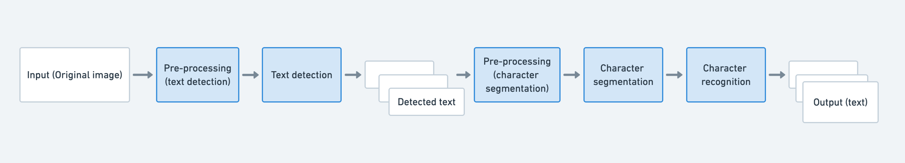

# ocr-rs

An OCR application for detecting and recognizing text (containing latin characters and numbers) of various scales and shapes (horizontal/multi-oriented/curved).

## Setup
To run the app locally, there are multiple possibilities:

1) you need to install
  - [rust](https://www.rust-lang.org/learn/get-started)
  - [libtorch](https://pytorch.org/get-started/locally/)

OR

2) run with [docker](https://www.docker.com/get-started) by building [Dockerfile from this repo](./Dockerfile) or by using an [already built image](https://hub.docker.com/r/lazareviczoran/ocr-rs)

## Progress:
- [x] Pre-processing
- [x] Text detection
- [ ] Pre-processing
- [ ] Character Segmentation
- [x] Character Recognition
- [ ] Add examples
